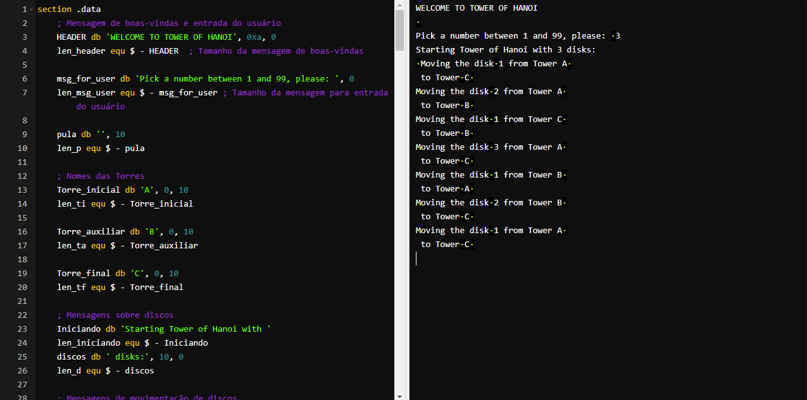

<h1 align="center">Torre de Hanoi em Assembly</h1>


<p align="center">
    <a href="objetivo">Objetivo do Projeto</a>
    <a href="executar">Como executar?</a>
    <a href="orientacoes">Orientações</a>
    <a href="especificacao">Especificação</a>
    <a href="exemplo">Exemplo de Saída:</a>
    <a href="licenc-a">Licença</a>
    <a href="contribuidores">Contribuidores</a>
</p>

<h2>Objetivo do Projeto</h2>

<h2>Como executar?</h2>

```
# 1) Acesse o site
$ https://www.tutorialspoint.com/compile_assembly_online.php

# 2) Copie o código "./asm-python/Torre_Hanoi.asm" e cole no editor de texto do site

# 3) Execute o projeto clicando no botão "Execute" no site
```
<h2>Orientações</h2>
Construa um programa em Assembly X86 sobre que resolva o quebra-cabeça clássico conhecido como Torre de Hanoi. A Torre de Hanoi é um jogo que envolve <strong>três torres A, B e C</strong>, contendo N discos com tamanhos diferentes dispostos em ordem decrescente de tamanho, estando o maior embaixo e o menor no topo da pilha. O objetivo deste jogo é mover todos os discos da Torre A para a Torre C, podendo usar a Torre B como auxiliar, seguindo a única regra essencial: nenhum disco maior pode ser colocado sobre um disco menor.

<p><strong>Visualização:</strong>
No link <a href="https://www.mathsisfun.com/games/towerofhanoi.html">https://www.mathsisfun.com/games/towerofhanoi.html</a>, você pode jogar ou ver a solução da Torre de Hanoi.</p>

<h2>Especificação</h2>
- Este projeto pode ser feito em dupla.
- A entrega se dará de forma presencial, apresentando e explicando o código em execução.
- A solução deve usar um procedimento recursivo.
- O número de discos deve ser inserido pelo usuário e pode ter até dois algarismos, ou seja, seu programa deve ser capaz de ler este número.
- O programa deve ser feito em Assembly X86 usando o compilador Tasm ou  Nasm para Windows ou Linux.
<ul>
    <li>NASM</li>
    <ul>
    <li>Sugestão de compilador online: <a href="http://www.tutorialspoint.com/compile_assembly_online.php"></li>
    <li>Info do Assembly NASM: <a href="https://mentebinaria.gitbook.io/assembly/"></li>
    <li>Tutorial de Assembly NASM: <a href="https://www.tutorialspoint.com/assembly_programming/index.htm"></li>
</ul>
</ul>
<ul>
    <li>TASM</li>
    <ul>
    <li>Como instalar o TASM: <a href="https://www.youtube.com/watch?v=PQqLLd7owdQ"></li>
    <li>Site do TASM: <a href="https://sourceforge.net/projects/guitasm8086/"></li>
    <li>Exempo de programação TASM: <a href="https://www.facom.ufu.br/~gustavo/OC1/Apresentacoes/Assembly.pdf"></li>
</ul>
</ul>
<h2>Exemplo de saída do programa:</h2>
```
# Algoritmo da Torre de Hanoi com 3 discos
Mova disco 1 da Torre A para a Torre C
Mova disco 2 da Torre A para a Torre B
Mova disco 1 da Torre C para a Torre B
Mova disco 3 da Torre A para a Torre C
Mova disco 1 da Torre B para a Torre A
Mova disco 2 da Torre B para a Torre C
Mova disco 1 da Torre A para a Torre C
Concluido!
```

```
Algoritmo da Torre de Hanoi com 3 discos
Mova disco 1 da Torre A para a Torre C
Mova disco 2 da Torre A para a Torre B
Mova disco 1 da Torre C para a Torre B
Mova disco 3 da Torre A para a Torre C
Mova disco 1 da Torre B para a Torre A
Mova disco 2 da Torre B para a Torre C
Mova disco 1 da Torre A para a Torre C
Concluido!
```
<h2>Licença</h2>

<h2>Contribuidores</h2>
